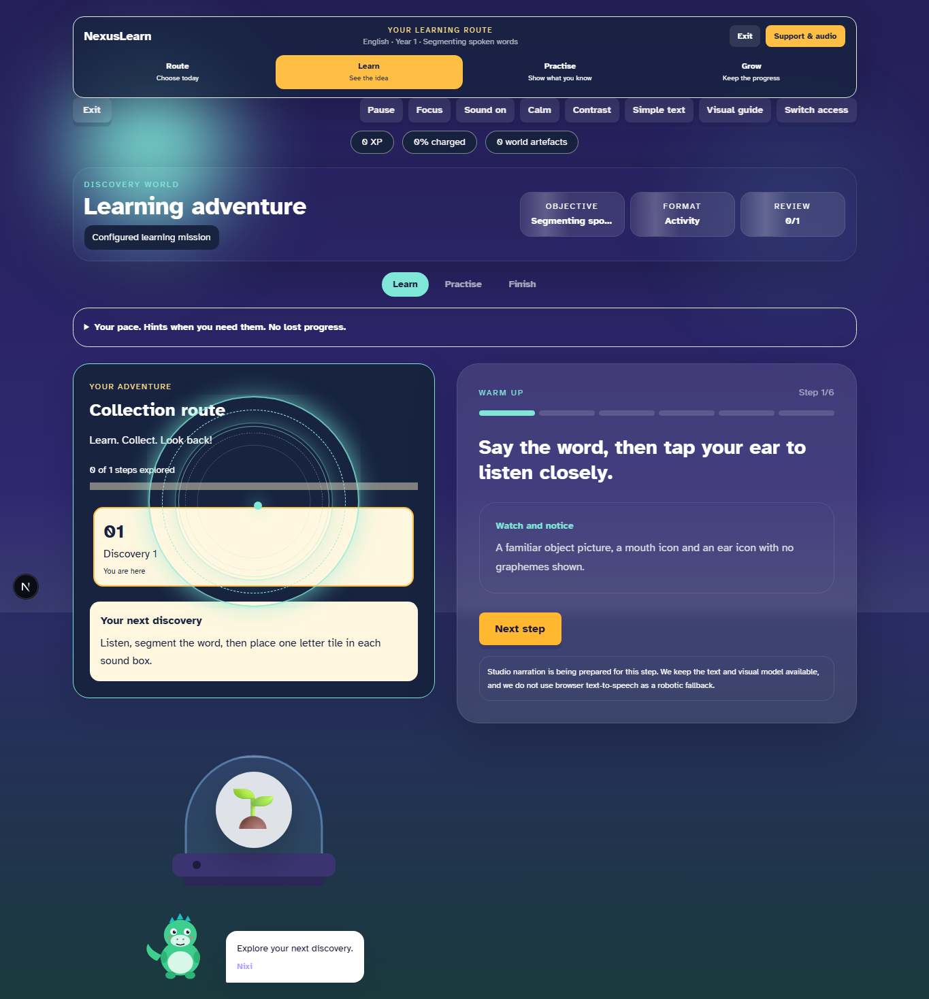
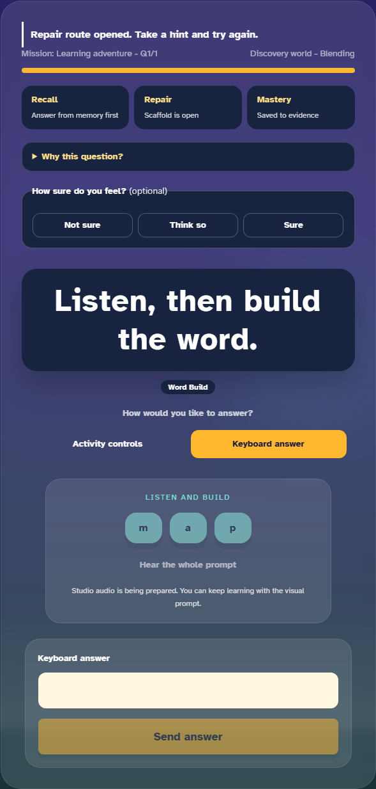
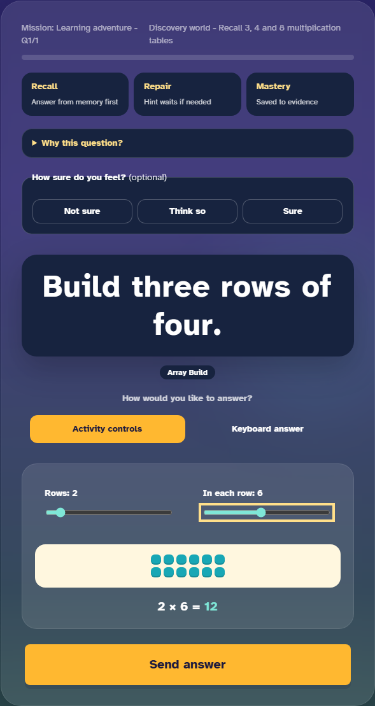
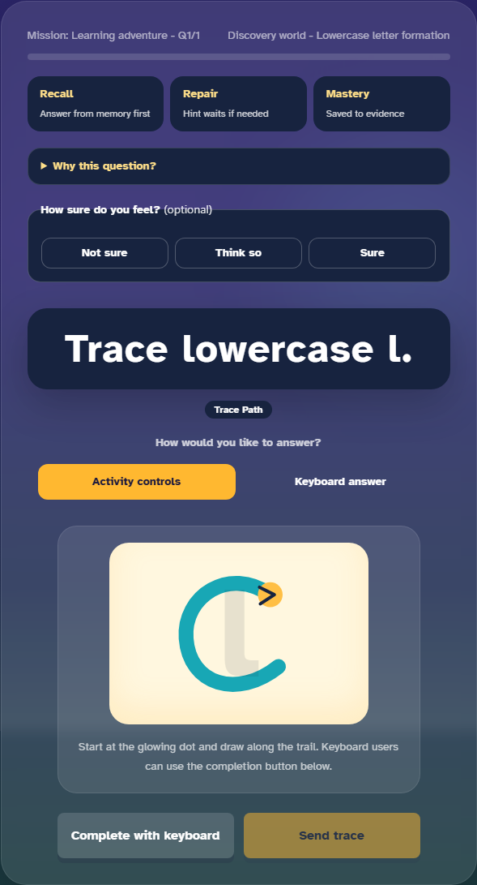
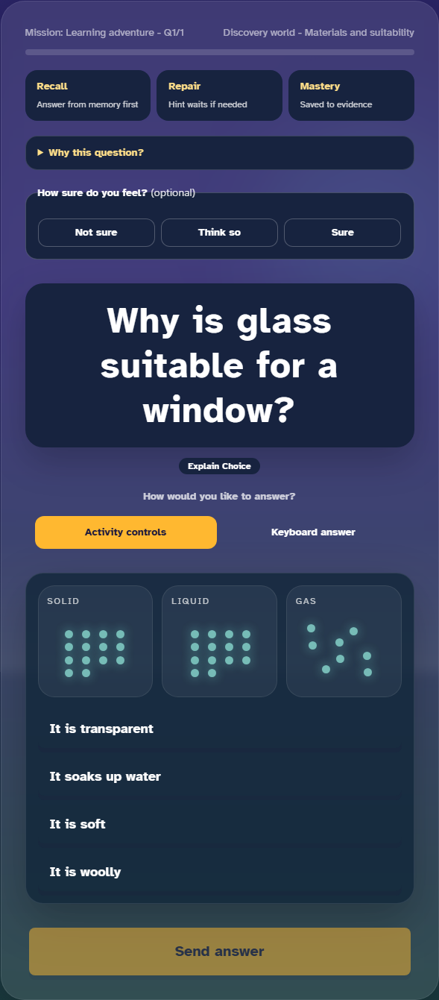
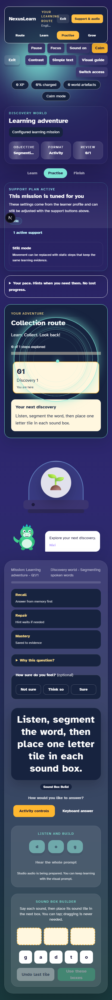

# NexusLearn game and learning-experience audit

Date: 5–6 September 2026. Reviewed source baseline: `c6b88f6a0e0a53241759546bafdf15de35a47474` on local `main`.

Historical baseline findings: see [the subsequent mission repair batch](2026-09-06-mission-repair-batch.md) for partial remediation. The reproduction harness is diagnostic evidence for this baseline; current behaviour is covered by the mission integrity regression tests.

## Decision

Do not approve the current game experience as complete or ready for unsupervised pupil use. It has useful components, but critical gaps exist in submission, grading, scaffolding, accessibility and the fidelity of educational models. The preceding green build and visual checks did not cover these behaviours sufficiently.

This is an engineering and product review, not an educational efficacy study. Browser fixtures use real locally authored questions through intercepted API responses. They deliberately exercise review-status content as well as approved examples so development gaps are visible. A mocked success response proves what the frontend submits; it does not prove that the deployed backend accepted an answer.

## Scope and evidence

- Read the mission controller, shared learning studio, renderer registry, all four renderer families, narration handling, scoring handler and persistence path, plus the flagship vision and animation/accessibility strategy.
- Counted 87 authored packs and 20,210 variants across Years 1–7. These contain 244 distinct format names. The dedicated renderer registry lists 91 names, of which 89 occur in the authored bank. Format names are not counts of distinct games; generic choices can be appropriate when they preserve the intended learning.
- Raw pack statuses are 20,148 `review` and 62 `approved`. These are **not** the imported AI decision totals, release approval totals or deployed database status.
- Static inventory found 37 numeric non-integer answers, tracing questions for all 26 lowercase letters, and 164 variants whose correct-feedback text begins with a machine-oriented answer-schema description.
- Browser survey and adversarial probe results are retained in `.agent/game-audit-2026-09-05/`. The completed survey covers one authored sample for each of the 244 format names, with seven initial navigation timeouts resolved by focused reruns. No page JavaScript exceptions were recorded in the final merged survey.
- Reproduction: from `apps/web`, run a local Next development server on port 3011 with `NEXT_PUBLIC_API_URL=http://api.test`, then run `node tools/game-quality-inventory.mjs`, `node tools/game-quality-audit.mjs`, and the same browser command with `AUDIT_FOLLOWUP=1` for the additional probes. This audit tool writes local evidence only; it does not submit live pupil records or grant approvals.

### Completed browser inventory

Merge `evidence.json` with `rerun-evidence.json` by format, giving the focused rerun precedence. Additional interaction evidence is in `followup-evidence.json` and `focused-probe-evidence.json`.

| Sample outcome | Format samples |
|---|---:|
| Mission content unavailable before the question panel | 11 |
| Question panel shows an unavailable-format fallback | 15 |
| Question panel renders without that fallback, but has no explicit submit/send button | 22 |
| Question panel includes an explicit submit/send button | 196 |
| Total distinct format samples | 244 |

These are inventory observations, **not 196 passing end-to-end tests**. Button presence does not establish valid grading or completion; absence requires checking whether another action submits. The sound-box construction was separately completed and produced neither a submit control nor an attempt request. Likewise, a sample rejected before rendering does not by itself prove that its renderer is absent: the question/answer contract may be incompatible. This is not a count of affected variants or deployed pupil failures.

The 22 rendered samples without explicit submission are `sound-box-build`, `noun-phrase-builder`, `evidence-highlight`, `clue-highlight`, `evidence-link`, `reader-effect-choice`, `argument-map`, `audio-sequence`, `coordinate-plot`, `error-analysis`, `method-choice`, `life-cycle-sequence`, `healthy-choice-explain`, `growth-sequence`, `fossil-sequence`, `circuit-builder`, `fair-test-plan`, `compare-model`, `energy-transfer-simulator`, `store-pathway-sort`, `prediction-observation-explanation`, and `variable-sort`.

## Findings in repair order

### G01 — P1: The server trusts the expected answer sent by the browser

`apps/web/src/app/play/mission/page.tsx` sends `expected` or `expected_text` in each attempt. `apps/api/internal/server/server.go:handleAttempt` passes that object to `learning.ScoreAttempt`. `apps/api/internal/learning/demo.go:attemptCorrect` compares the supplied given and expected fields. `PostgresRepository.RecordAttempt` persists that result and updates mastery without retrieving the canonical question answer. Mock preparation checks membership and duplicate attempts, not the answer key.

Consequences: changing client fields can change correctness; equivalent structured responses depend on serialization; trace completion can be mistaken for evaluated letter formation. The same evidence feeds progress and recommendations, so this is a product correctness blocker.

Acceptance: the server loads the question/version and permitted assessment membership; ignores client answer keys; validates response type; scores using an explicit format-aware contract; rejects fabricated/mismatched question/objective IDs. Tests must include forged expectations, array/set ordering, accepted alternatives, numeric precision and invalid response shapes.

### G02 — P1: Multiple activity builders have no complete submission path

The studio uses separate lists of format booleans to decide whether to render answer and submit controls. Several registered components provide local selection controls but do not receive or invoke `onSubmit`, while the surrounding studio excludes them from generic submission. Sound boxes and noun phrase building are concrete examples. Coordinate, sequence, error-analysis, method-choice, fair-test and comparison tasks require format/shape-specific checking rather than assuming registration makes them playable.

Acceptance: each supported response contract has a visible, reachable, meaningful submit action after valid input. Selecting tiles, choosing a method or pressing “Use these boxes/order” must lead to submission without requiring a pupil to discover a different response mode. Test every structural variant of a format, including text, scalar, sequence and mapping answers.

### G03 — P1: Authored hints are not displayed, but hint use is recorded

The mission loads `question.hints` into `q.hints`, yet no rendering path consumes those strings. After a mistake it sets `showHint`, displays “Take a hint”, and emits `hint_opened`. The only shared scaffold is a numeric array where dimensions happen to exist. The browser retry probe found no visible authored hints for a word-building item, while the next attempt carried `hint_used: true`.

Acceptance: a pupil can open a relevant hint before or after an error; hints appear in a controlled sequence; the request records actual assistance used. Distinguish a failed attempt from use of support. Display explanatory feedback close to the task, including in focus mode. Returning to teaching must be available after repeated difficulty.

### G04 — P1: Single-switch access does not cover the complete learning flow

The scanner selects only buttons and explicit `tabindex="0"` nodes inside `[data-switch-region]`, which surrounds the question renderer. New feedback continuation and final navigation controls are outside it. Native selects and range controls are also absent from scan targets. This contradicts claims that every response mode can complete the same activity.

The focused browser probe reached feedback with “See my discoveries” visible and found zero eligible controls inside the scanner's selector. This confirms the continuation gap; it is not a full assistive-device validation.

Acceptance: a single-switch pupil can enter teaching, hear/replay instruction, construct an answer, request help, submit, continue from feedback, and reach the next mission. Selects/sliders need appropriate scanning actions rather than a click alone. Preserve standard keyboard operation and a clear way to stop scanning.

### G05 — P1: Tracing does not assess the advertised letter formation

`TraceTrail` uses one hard-coded c-shaped path for every letter, while the bank contains a–z. Completion is based on accumulating at least eight pointer samples, with no start-point, direction or path test. The keyboard completion button directly emits the expected marker. The intended rubric explicitly mentions start, direction and following the path.

The browser confirmed that changing the letter to `l` still displays the c-shaped guide. The arbitrary-stroke probe did **not** enable submission, so this audit does not claim a reproduced arbitrary-stroke pass. The sample-count-only grading defect is established by source inspection; pointer reachability needs separate repair testing.

Acceptance: use authored per-letter paths and accessible alternatives appropriate to the learning goal. Record tracing as practice/participation until the observation contract can support a claim about formation. An alternative that assesses letter recognition should report that evidence, not handwriting mastery. Do not penalise motor access needs.

### G06 — P1: Decimal answers cannot survive the current request contract

The mission uses `parseInt(input, 10)`. `learning.Attempt.Given` and `.Expected` are Go integers. The authored bank contains 37 non-integer numeric answers, including Year 3 tenths.

In a controlled decimal probe, typing `2.5` sent `given: 2` alongside `expected: 2.5`. The intercepted API returned the configured fixture response; this does not demonstrate that the real Go API would accept the fractional expected field.

Acceptance: select a consistent numeric representation across authored content, browser, API and grader; preserve decimals and negative signs; use tolerance only when educationally justified. Test an actual authored 0.1 response end to end. The visible number pad also needs controls consistent with the allowed domain, not just digits and delete.

### G07 — P1: Scientific models can contradict their own learning purpose

The particle simulation begins at energy 45 (liquid) even when the authored item requests a solid start. It renders 14 particles for solid/liquid and 8 for gas, while the approved melting question says particle count is invariant and asks the pupil to count before and after. Moving the energy slider does not contribute to the submitted response; selecting the expected text can complete the task without the requested experiment.

Additionally, the generic `explain-choice` format always mounts particle chambers across unrelated science topics: the browser showed solid/liquid/gas diagrams for “Why is glass suitable for a window?”. The prefix fallback `startsWith('fo')` would also assign a force model to unrelated matching names when choices exist; the sampled food-chain item instead displayed the unavailable-format fallback. These are semantic dispatch problems, not cosmetic details.

Acceptance: dispatch by an explicit learning interaction contract; honour initial conditions and physical invariants; record an observation or experiment when required by the question. Keep an equivalent still/step-controlled route. Never attach unrelated scientific diagrams merely because an answer uses a common format name.

### G08 — P1: A retry after an uncertain save gets a new attempt ID

`clientRequestId("attempt")` runs inside every submit. Failure clears the input, and the next submit generates a fresh ID. Backend idempotency can replay only when the original key is retained. A response lost after a committed save could therefore produce duplicate evidence on retry; mock attempts may instead hit the already-answered guard.

The focused browser probe returned a simulated HTTP 503, observed an empty answer and no visible save-error message, then submitted the same answer again with a different ID. The failure path sets the message in state, but it was not visible in this tested question view. This reproduces the client behaviour, not a duplicate database write: response-loss-after-commit remains an integration acceptance test.

Acceptance: retain a pending attempt's ID and immutable payload until its outcome is known. Keep the child's answer visible on a save failure. A deliberate new attempt gets a new ID only after a conclusive response. Verify response-loss-after-commit, not just HTTP failure before saving.

### G09 — P2: Construction and reasoning steps are not reliably captured as evidence

Array building submits only the product, so 2×6 is indistinguishable from the requested 3 rows of 4. Method selection and some equivalent-expression controls are local UI state; final-number submission does not describe them. A visual manipulative may be a useful scaffold, but its presence does not establish that the requested construction or reasoning was completed.

Acceptance: explicitly define what each task assesses. Record arrangement, ordered stages, variable selection or reasoning choices when they are necessary evidence. If only a final answer is assessed, the wording and reports must say so. Accept mathematically equivalent constructions where the objective allows them.

### G10 — P2: Early-years tasks reveal answers and place too much UI before learning

The phoneme-count screen displays exactly the required number of counters before the child answers. The counters are spans, despite an instruction to tap them. The same screen repeats answer choices in two groups. Sound-building panels display ordered sound labels before the child segments the word. Such scaffolds may be useful during modelling, but should not be indistinguishable from independent assessment.

Captured Year 1 screens place “Recall / Repair / Mastery”, selection explanations, confidence controls and format labels before the actual activity. The new journal and incubator add further content ahead of the task in a one-column layout. In the captured 412×839 calm mobile viewport, the page was 3,678 pixels tall and the question panel began 2,061 pixels down. There was no horizontal page overflow in that case; the vertical hierarchy was the problem.

Acceptance: present one short child instruction and its playable model first. Offer optional support and confidence at appropriate moments. During independent assessment, hide answer-revealing scaffolds until requested and record their use. Use counters the child can add/remove, with equivalent keyboard/switch actions. Check age-appropriate reading load and mobile scroll distance.

### G11 — P2: Several named simulations and teaching models remain prose/choice panels

Force, population and circuit-symbol renderers contain useful evidence/choice scaffolds, but their instructions mention changing variables, inspecting frames or placing symbols where the UI offers no such action. Teaching steps display `visual_model` as text describing an intended scene. The four journey reward styles currently alter labels/copy and some borders; they do not supply four distinct story/build/challenge mechanics.

Acceptance: either implement the promised interaction or describe the current task accurately. Prioritise reusable, curriculum-correct models for number/fractions, words/sentences, evidence sorting, graphs and scientific experiments. Link a learning action to a visible world consequence. Age progression should change the activity's presentation and agency, not just its heading or reward symbol.

### G12 — P2: Audio access needs wiring and transport checks as well as listening approval

The sound-box pack references `whole_word_audio_asset_id` and `phoneme_audio_asset_ids`; the frontend field resolver and `AudioBlend` use different keys. Current captures show disabled sound chips and no playable whole prompt. Assets awaiting approval must remain gated, but a spelling/segmenting task that requires listening cannot silently become the same assessment with an unavailable prompt.

`playProducedAudio` creates a new audio instance on every call; there is no retained player to stop a previous clip when replaying, moving to the next question, or muting. Muting prevents future playback but does not stop the current instance. Some feedback replay buttons are shown based on a script/reference even when no playable URL exists.

Acceptance: normalise authored audio fields at an explicit boundary; resolve released assets; show honest available/loading/unavailable states; prevent overlapping narration; make mute/stop effective immediately; stop obsolete audio on navigation. Listening tasks need an appropriate unavailable or assisted route. Verify released clips technically and through the listening workspace. This audit does not claim to have listened to all assets.

### G13 — P2: Feedback and review state do not yet provide a durable learning story

The new journal provides useful explicit pacing and a way to revisit entries within the current mission. Its entries are local React state, not a saved cross-session journal. UI construction state and parent answer state can diverge after response-mode changes or retries. The generic feedback policy uses objective/world reward rules, while authored question-specific explanation is not selected by the attempt handler.

Acceptance: store durable discoveries only where the product promises cross-session access; reconcile builder state with the answer shown/submitted; use question-specific explanations and misconception repairs; restore progress after navigation without inventing completed work. Keep fun rewards distinct from mastery and independent evidence.

## Positive foundations

- Large labelled tap targets and undo controls in word/sound builders.
- Multiple response-mode intentions and a reduced-motion/high-contrast foundation.
- Explicit feedback continuation improves time to read and understand a response.
- Array and fraction manipulatives offer concrete models where wired correctly.
- Backend persistence, idempotency machinery, subject progress data and spaced-review structures already exist; the gaps above concern their connections and evidence integrity.
- The existing teacher/admin review surfaces should be tested and refined, not rebuilt from an assumption that they are absent.

## Observed journey stages

| Step | Experience | Assessment |
|---|---|---|
| 1 | Enter the configured mission | The local API fixture loads the selected authored question; this does not verify real authentication or deployed selection. |
| 2 | Learn from a teaching step | Needs work: the sampled “Watch and notice” panel displays the author's description of a picture instead of the picture/model. |
| 3 | Explore and construct an answer | Mixed: working tile/array controls coexist with missing submission paths and model/interaction mismatches. |
| 4 | Make a mistake and use support | Fails the tested hint contract: the UI announces support but omits the authored hints and marks the retry as assisted. |
| 5 | Read feedback and continue | Explicit continuation is helpful; scanner scope and request-integrity defects still need correction. |
| 6 | Play on a small screen | No horizontal overflow in the sampled calm mobile case, but the learning task is far below the initial viewport. |

The following screenshots were captured in this run and visually inspected. Additional raw captures and request evidence are in the evidence directory.

### Teaching step: description displayed instead of the authored model

### Word retry: hint announced but not supplied

### Construction evidence: different arrangement, same submitted product

### Tracing: the requested letter and guide disagree

### Science context: irrelevant particle models

### Mobile hierarchy

## Why earlier green checks were insufficient

The renderer accessibility suite contains twelve scenarios (run in two viewport projects), primarily covering eight common interaction formats and shared controls. Its switch test selects an option and checks that submission becomes enabled; it does not submit and continue to the next stage using the switch. The registry tests establish dispatch and fallback presence. The content readiness gate checks data fields against capability labels. These are useful checks, but none establish that every authored response shape is operable or that a scientific model teaches the right relationship.

Passing those checks must not be presented as certification of all games, all SEND routes or all variant quality. AI reviews of authored content likewise do not establish that the browser and scoring implementation honour it.

## Repair batches and acceptance gates

1. **Learning integrity and access:** server-authoritative grading, typed responses, complete submit paths, honest hint tracking, scanning across every stage, retry identity. Demonstrate correct, incorrect, assisted, uncertain-save and resumed flows before a push.
2. **Models and audio:** correct tracing semantics, particle invariants, explicit renderer contracts, shared controlled narration, answer-free independent assessment. Walk through authentic samples from all seven years using ordinary, calm, keyboard and switch routes.
3. **Age-appropriate game experience:** put the activity first; realise the most valuable authored teaching models; make world changes follow learning actions; develop age-specific challenge/creation depth. Preserve comparable learning in still mode.
4. **Release evidence:** replay against a seeded real backend; check parent/school/admin evidence for those sessions; verify deployed CI/runtime version; conduct the outstanding listening, safeguarding and pupil usability reviews. No approval is granted by this report.

Each batch should fix a coherent cross-year capability rather than adding more variant volume. The acceptance matrix must include every different response shape, not only one test per renderer family. A static readiness script that validates JSON fields cannot establish completion, submit reachability, meaningful interaction or educational validity.

## Reference principles

The review uses clear instructions, appropriate scaffolding, explicit modelling and feedback a pupil can act on as educational criteria, consistent with [EEF guidance on evidence-based SEND teaching](https://educationendowmentfoundation.org.uk/news/five-evidence-based-strategies-pupils-with-special-educational-needs-send/). Keyboard operation and control of prolonged movement are checked against [WCAG 2.2](https://www.w3.org/TR/WCAG22/). These sources guide acceptance criteria; they do not certify this implementation or establish efficacy with children.

## Limits

This review does not certify every one of the 20,210 variants, UK-wide curriculum alignment, real-child engagement, all narration quality, or deployed backend state. Existing review-status content was exercised locally to uncover build requirements. Browser request fixtures do not validate database persistence or adaptive progression. Those require seeded integration evidence after the identified defects are corrected.
