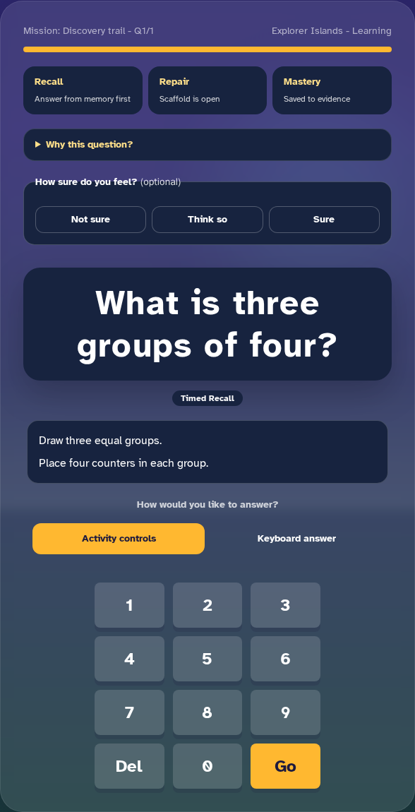
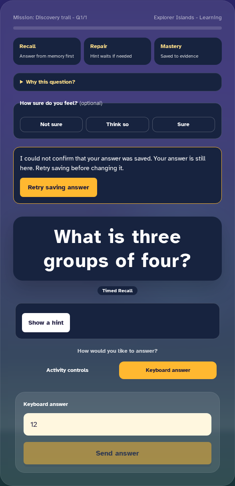

# Mission repair batch — 6 September 2026

Baseline: local and GitHub main `c6b88f6a0e0a53241759546bafdf15de35a47474` (remote checked during this batch).

## Implemented scope

- Shared submission for registered builders that publish answers but do not own submit controls. Existing specialised submit/validation controls remain responsible for their own formats. Sound boxes reject incomplete/empty construction before submission; noun phrases can send the built text.
- Authored hints are shown progressively after explicit pupil requests. Wrong answers alone no longer mark a retry as assisted. Mock assessments do not gain hint controls.
- Uncertain saves preserve the visible answer and immutable serialized request, including ID, timing, confidence and hint use. The answer controls are locked until retry is acknowledged, and the save problem is visible next to the question. A bounded request timeout and malformed-success check use the same recovery path.
- Switch scanning covers teaching, feedback and summary actions as well as question buttons. It includes links, ignores held-key repeats, and refreshes on stage changes. A disappearing or disabled highlighted target cannot activate a different control at its old index. While paused, scanning is confined to the pause dialog, not the background answer controls.
- Response-mode changes remount the studio so local builder state is not carried into a different response mode.
- Specialist keyboard renderers retain a single validated submission path. Consolidated shared format rules remove the duplicate generic submit button without bypassing the specialised renderer's validation.
- Support telemetry runs in the click handler, not a React state updater. A failing development-mode test reproduced four records from two Focus actions; the corrected implementation records two.
- Renderer visual tests capture the complete interaction instead of cropping/padding to historical heights. The test stylesheet hides Next's development indicator only; pupil-facing controls are not masked. Screenshot thresholds are unchanged.

## Review evidence

One narrowly scoped independent reviewer found the disappearing-hint switch bug. A paused-clock Playwright test reproduced the answer being lost; activation now checks the actual highlighted element. The reviewer was closed after returning findings. No other agents were used.

The initial regression run demonstrated missing submission/hint controls, false hint-use recording, invisible save failure and unreachable switch continuation. One sound-box fixture initially used the wrong field name; it was corrected to `sound_boxes`, matching authored content, before the successful builder checks.

Windows combined run: 36/38 passed, with two cold-start timeouts. Both timed-out cases passed a focused rerun with a longer overall development-test budget; assertion timeouts and CI thresholds were not relaxed.

Final-source TypeScript (Next build) and focused ESLint passed. The normal content prebuild passed earlier in the same isolated Linux workspace; subsequent source-only builds passed. The final asset gate passed at 1,404,818 aggregate JavaScript bytes against the unchanged 1,405,000 ceiling; maximum route JavaScript 675,235, largest JS file 222,189, total CSS 63,197 and largest public asset 472,354 bytes. The performance gate's five unit tests passed. Headroom is narrow and future work still needs deliberate bundle reduction.

The first eight mission regression cases passed on Linux desktop/mobile (16 tests), followed by independent red-green checks for duplicate support telemetry and pause-dialog scanning. Earlier broad runs exposed cold-hydration races in admin review test setup: network traces showed authenticated workspace requests starting around/after the five-second assertion deadline. Audio review now installs the fake account before a single navigation; both affected fixtures wait for page load instead of the earlier DOMContentLoaded event. Authorisation and assertions were not weakened. The focused audio/pause rerun passed all six desktop/mobile cases.

Final Linux run: **134/134 passed in 16.6 minutes**, with no retries used, after all product/test changes. Command: `npx playwright test --workers=1 --retries=1 --max-failures=5`. The 134 cases include all ten new integrity regressions on desktop/mobile, role boundaries, admin audio/content review, parent/school journeys, mock history, renderer access and gamification. This was a normal assertion run without snapshot updates, following a separate four-test baseline-generation run. All 22 visual baselines were generated in the Playwright Linux image; representative full-height desktop/mobile images were inspected. Pixel tolerances were not increased.

### Release follow-up: fractional screenshot bounds

The first push (`6b1b1c9`) passed Vercel, content quality, API tests/migrations, frontend build and asset budgets. GitHub's browser run passed 132 cases but failed the two renderer-visual cases: desktop expected 588×1198 and captured 588×1199; mobile expected 380×1407 and captured 380×1406. No trace artifacts were uploaded by the old workflow, so the diagnosis started with the job's screenshot-dimension logs.

A focused synthetic regression reproduced an extra raster row when an otherwise identical element had a fractional vertical origin. The test-only alignment helper rounds the current region's minimum height upwards and aligns its origin, each by less than one CSS pixel. It does not resize the PNG, crop content, set a historical height or widen comparison tolerances. The regression verifies stable complete-image dimensions across four fractional origins and that the bottom submit control remains inside the captured region. Both desktop/mobile checks pass. The complete visual suite plus these regressions passed a separate six-test run with two workers after refreshing the 16 renderer baselines; focused ESLint passed. The workflow now retains failure screenshots and traces for seven days.

This follow-up changes test infrastructure only. Product-source verification and the remaining release blockers above still apply; GitHub must verify the follow-up commit independently.

## What this does not close

### Inspected repair screenshots

### Remaining gates

This is **not** approval of the game experience or all variants. G02 is only partially addressed: unavailable formats and response-shape-specific completion/validation still need work. G04 still requires complete single-switch operation for native selects/ranges and broader navigation. Request replay is verified at the browser boundary, not against a database response lost after commit; navigation/reload recovery is not implemented here.

The server still trusts client answer keys. Numeric/structured response contracts, tracing evidence, scientific models, audio wiring/listening, and the larger activity-first age-specific redesign remain release blockers in the 5 September audit. The [canonical-grading implementation plan](../superpowers/plans/2026-09-06-canonical-grading.md) specifies the next backend/client contract batch; it is not implemented by this commit. Do not claim trustworthy end-to-end mastery or production readiness until those are resolved.

## Delivery discipline

Only scoped source/tests/docs and intentionally reviewed Linux-generated visual baselines belong in this batch. Existing generated-content edits and local diagnostic artifacts are not silently included. No curriculum approvals, credential changes or live pupil records are part of this work.
